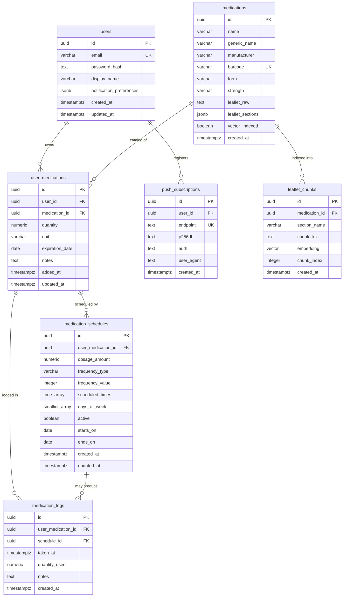

# ECZAM — Database Design

> The authoritative data model: tables, columns, constraints, indexes, the vector
> store, migration strategy (Flyway), JPA entity mapping notes, and data-lifecycle
> invariants. Schema is taken verbatim from the brief (§6, §8.5).

**Status:** Draft · **Owner:** Eng · **Last updated:** 2026-06-18
**Related:** [system-architecture.md](system-architecture.md) · [api-specification.md](api-specification.md) · [functional-requirements.md](functional-requirements.md) · [security-requirements.md](security-requirements.md)

---

## 1. Conventions

- **Engine:** PostgreSQL with the **`vector`** (pgvector) extension.
- **Primary keys:** UUID, `DEFAULT gen_random_uuid()`.
- **Timestamps:** `created_at` / `updated_at` as `TIMESTAMPTZ NOT NULL DEFAULT NOW()`.
- **Access:** parameterized statements only (JPA / prepared) — no string
  interpolation (NFR-042).
- **Migrations:** **Flyway** (`V1__init.sql`, …). The SQL below is the source of
  truth the migrations implement.

## 2. Entity-relationship diagram



## 3. Table dictionary

### 3.1 `users`

| Column | Type | Notes |
|---|---|---|
| id | UUID PK | `gen_random_uuid()` |
| email | VARCHAR(255) | UNIQUE, NOT NULL |
| password_hash | TEXT | NOT NULL (bcrypt) |
| display_name | VARCHAR(100) | nullable |
| notification_preferences | JSONB | default below |
| created_at / updated_at | TIMESTAMPTZ | NOT NULL DEFAULT NOW() |

`notification_preferences` default shape:

```json
{ "push": true, "email": false, "low_stock_threshold": 7, "expiry_warning_days": 30 }
```

### 3.2 `medications` (global catalog, shared across users)

| Column | Type | Notes |
|---|---|---|
| id | UUID PK | |
| name | VARCHAR(255) | NOT NULL |
| generic_name | VARCHAR(255) | nullable |
| manufacturer | VARCHAR(255) | nullable |
| barcode | VARCHAR(100) | UNIQUE |
| form | VARCHAR(50) | tablet, capsule, syrup, injection, … |
| strength | VARCHAR(50) | e.g. "500mg", "10mg/5ml" |
| leaflet_raw | TEXT | raw extracted leaflet text |
| leaflet_sections | JSONB | `{ dosage, side_effects, contraindications, storage, interactions, missed_dose }` |
| vector_indexed | BOOLEAN | DEFAULT FALSE; true after ingestion (UC-010) |
| created_at | TIMESTAMPTZ | |

### 3.3 `user_medications` (personal inventory)

| Column | Type | Notes |
|---|---|---|
| id | UUID PK | |
| user_id | UUID FK → users(id) | ON DELETE CASCADE |
| medication_id | UUID FK → medications(id) | |
| quantity | NUMERIC(10,2) | NOT NULL DEFAULT 0; current stock |
| unit | VARCHAR(20) | NOT NULL DEFAULT 'pill' (pill, ml, patch, …) |
| expiration_date | DATE | nullable |
| notes | TEXT | nullable |
| added_at / updated_at | TIMESTAMPTZ | |

**Constraint:** `UNIQUE (user_id, medication_id, expiration_date)` — allows the same
medication held as separate **expiry batches** (FR-025).

### 3.4 `medication_schedules`

| Column | Type | Notes |
|---|---|---|
| id | UUID PK | |
| user_medication_id | UUID FK → user_medications(id) | ON DELETE CASCADE |
| dosage_amount | NUMERIC(6,2) | NOT NULL; units per dose |
| frequency_type | VARCHAR(20) | NOT NULL: daily / weekly / interval |
| frequency_value | INTEGER | e.g. every N days (interval) |
| scheduled_times | TIME[] | NOT NULL; e.g. `{08:00,20:00}` |
| days_of_week | SMALLINT[] | `[1,3,5]`=Mon/Wed/Fri; NULL=every day |
| active | BOOLEAN | NOT NULL DEFAULT TRUE (pause/resume) |
| starts_on | DATE | NOT NULL DEFAULT CURRENT_DATE |
| ends_on | DATE | nullable |
| created_at / updated_at | TIMESTAMPTZ | |

### 3.5 `medication_logs` (immutable)

| Column | Type | Notes |
|---|---|---|
| id | UUID PK | |
| user_medication_id | UUID FK → user_medications(id) | ON DELETE CASCADE |
| schedule_id | UUID FK → medication_schedules(id) | ON DELETE SET NULL |
| taken_at | TIMESTAMPTZ | NOT NULL DEFAULT NOW() |
| quantity_used | NUMERIC(6,2) | NOT NULL |
| notes | TEXT | nullable |
| created_at | TIMESTAMPTZ | |

Rows are **append-only** (no updates/deletes in normal operation) — the adherence
audit trail.

### 3.6 `push_subscriptions`

| Column | Type | Notes |
|---|---|---|
| id | UUID PK | |
| user_id | UUID FK → users(id) | ON DELETE CASCADE |
| endpoint | TEXT | UNIQUE, NOT NULL |
| p256dh | TEXT | NOT NULL (Web Push key) |
| auth | TEXT | NOT NULL (Web Push auth secret) |
| user_agent | TEXT | nullable (device id aid) |
| created_at | TIMESTAMPTZ | |

### 3.7 `leaflet_chunks` (pgvector store) — *brief §8.5*

| Column | Type | Notes |
|---|---|---|
| id | UUID PK | |
| medication_id | UUID FK → medications(id) | ON DELETE CASCADE |
| section_name | VARCHAR(100) | NOT NULL (e.g. 'side_effects') |
| chunk_text | TEXT | NOT NULL |
| embedding | VECTOR(1536) | matches `text-embedding-3-small` |
| chunk_index | INTEGER | NOT NULL |
| created_at | TIMESTAMPTZ | |

> If a different embedding model is chosen, the `VECTOR(n)` dimension must match it.

## 4. Authoritative DDL

```sql
-- Extensions
CREATE EXTENSION IF NOT EXISTS vector;

-- users
CREATE TABLE users (
    id              UUID PRIMARY KEY DEFAULT gen_random_uuid(),
    email           VARCHAR(255) UNIQUE NOT NULL,
    password_hash   TEXT NOT NULL,
    display_name    VARCHAR(100),
    notification_preferences JSONB DEFAULT '{
        "push": true, "email": false,
        "low_stock_threshold": 7, "expiry_warning_days": 30
    }',
    created_at      TIMESTAMPTZ NOT NULL DEFAULT NOW(),
    updated_at      TIMESTAMPTZ NOT NULL DEFAULT NOW()
);

-- medications (global catalog)
CREATE TABLE medications (
    id               UUID PRIMARY KEY DEFAULT gen_random_uuid(),
    name             VARCHAR(255) NOT NULL,
    generic_name     VARCHAR(255),
    manufacturer     VARCHAR(255),
    barcode          VARCHAR(100) UNIQUE,
    form             VARCHAR(50),
    strength         VARCHAR(50),
    leaflet_raw      TEXT,
    leaflet_sections JSONB,
    vector_indexed   BOOLEAN DEFAULT FALSE,
    created_at       TIMESTAMPTZ NOT NULL DEFAULT NOW()
);

-- user_medications (inventory)
CREATE TABLE user_medications (
    id              UUID PRIMARY KEY DEFAULT gen_random_uuid(),
    user_id         UUID NOT NULL REFERENCES users(id) ON DELETE CASCADE,
    medication_id   UUID NOT NULL REFERENCES medications(id),
    quantity        NUMERIC(10, 2) NOT NULL DEFAULT 0,
    unit            VARCHAR(20) NOT NULL DEFAULT 'pill',
    expiration_date DATE,
    notes           TEXT,
    added_at        TIMESTAMPTZ NOT NULL DEFAULT NOW(),
    updated_at      TIMESTAMPTZ NOT NULL DEFAULT NOW(),
    UNIQUE (user_id, medication_id, expiration_date)
);

-- medication_schedules
CREATE TABLE medication_schedules (
    id                  UUID PRIMARY KEY DEFAULT gen_random_uuid(),
    user_medication_id  UUID NOT NULL REFERENCES user_medications(id) ON DELETE CASCADE,
    dosage_amount       NUMERIC(6, 2) NOT NULL,
    frequency_type      VARCHAR(20) NOT NULL,
    frequency_value     INTEGER,
    scheduled_times     TIME[] NOT NULL,
    days_of_week        SMALLINT[],
    active              BOOLEAN NOT NULL DEFAULT TRUE,
    starts_on           DATE NOT NULL DEFAULT CURRENT_DATE,
    ends_on             DATE,
    created_at          TIMESTAMPTZ NOT NULL DEFAULT NOW(),
    updated_at          TIMESTAMPTZ NOT NULL DEFAULT NOW()
);

-- medication_logs (immutable)
CREATE TABLE medication_logs (
    id                  UUID PRIMARY KEY DEFAULT gen_random_uuid(),
    user_medication_id  UUID NOT NULL REFERENCES user_medications(id) ON DELETE CASCADE,
    schedule_id         UUID REFERENCES medication_schedules(id) ON DELETE SET NULL,
    taken_at            TIMESTAMPTZ NOT NULL DEFAULT NOW(),
    quantity_used       NUMERIC(6, 2) NOT NULL,
    notes               TEXT,
    created_at          TIMESTAMPTZ NOT NULL DEFAULT NOW()
);

-- push_subscriptions
CREATE TABLE push_subscriptions (
    id          UUID PRIMARY KEY DEFAULT gen_random_uuid(),
    user_id     UUID NOT NULL REFERENCES users(id) ON DELETE CASCADE,
    endpoint    TEXT NOT NULL UNIQUE,
    p256dh      TEXT NOT NULL,
    auth        TEXT NOT NULL,
    user_agent  TEXT,
    created_at  TIMESTAMPTZ NOT NULL DEFAULT NOW()
);

-- leaflet_chunks (pgvector)
CREATE TABLE leaflet_chunks (
    id              UUID PRIMARY KEY DEFAULT gen_random_uuid(),
    medication_id   UUID NOT NULL REFERENCES medications(id) ON DELETE CASCADE,
    section_name    VARCHAR(100) NOT NULL,
    chunk_text      TEXT NOT NULL,
    embedding       VECTOR(1536),
    chunk_index     INTEGER NOT NULL,
    created_at      TIMESTAMPTZ NOT NULL DEFAULT NOW()
);
```

## 5. Indexes — *brief §6.7, §8.5*

```sql
CREATE INDEX idx_user_medications_user_id ON user_medications(user_id);
CREATE INDEX idx_user_medications_expiration ON user_medications(expiration_date)
    WHERE expiration_date IS NOT NULL;
CREATE INDEX idx_medication_schedules_active ON medication_schedules(user_medication_id)
    WHERE active = TRUE;
CREATE INDEX idx_medication_logs_user_med ON medication_logs(user_medication_id, taken_at DESC);
CREATE INDEX idx_push_subscriptions_user_id ON push_subscriptions(user_id);

CREATE INDEX idx_leaflet_chunks_medication ON leaflet_chunks(medication_id);
CREATE INDEX idx_leaflet_chunks_embedding ON leaflet_chunks
    USING hnsw (embedding vector_cosine_ops);
```

Rationale: partial indexes keep hot queries (expiry scan, active-schedule scan) lean;
the composite log index serves the "history newest-first" query; the **HNSW** index
serves approximate-nearest-neighbor cosine search for RAG (NFR-003/032).

## 6. Flyway migration strategy

- Versioned SQL migrations under `backend/src/main/resources/db/migration`
  (`V1__extensions.sql`, `V2__core_tables.sql`, `V3__indexes.sql`, …); the vector
  extension is created first.
- Flyway runs on application startup (and in CI against a Testcontainers Postgres).
- Schema changes are **forward-only**; never edit an applied migration — add a new one.
- Seed data (e.g. an initial leaflet corpus) lives in repeatable/seed migrations or a
  separate loader, not mixed into schema migrations.

## 7. JPA entity-mapping notes

| Schema feature | Mapping guidance |
|---|---|
| UUID PK | `@Id @GeneratedValue` with UUID strategy / DB default |
| `TIMESTAMPTZ` | `OffsetDateTime` / `Instant` |
| `DATE` | `LocalDate` |
| JSONB (`notification_preferences`, `leaflet_sections`) | `@JdbcTypeCode(SqlTypes.JSON)` or a JSON converter to a typed POJO |
| `TIME[]` (`scheduled_times`) | array mapping → `List<LocalTime>` (Hibernate array type) |
| `SMALLINT[]` (`days_of_week`) | array mapping → `List<Short>` |
| `VECTOR(1536)` | pgvector Hibernate type or native query; store `float[]` |
| `active`, `vector_indexed` defaults | DB defaults; insertable=false where appropriate |

## 8. Data lifecycle & invariants

- **Atomic dose logging (NFR-021):** inserting a `medication_logs` row and
  decrementing `user_medications.quantity` happen in **one transaction** (lock the row
  `FOR UPDATE`); quantity must not go negative (FR-043). See UC-005.
- **Immutability of logs:** `medication_logs` is append-only — the adherence/audit
  trail.
- **Cascades:** deleting a user removes their inventory, schedules (via inventory),
  logs (via inventory), and push subscriptions; deleting an inventory entry removes
  its schedules and logs; deleting a schedule sets `medication_logs.schedule_id` to
  NULL (preserving the historical dose).
- **Catalog vs inventory:** `medications` is global/shared; user-specific data lives in
  `user_medications`. Deleting a user never deletes catalog rows.
- **Vector indexing:** `vector_indexed` gates the assistant — an unindexed medication
  yields a graceful "can't answer" (FR-073).
- **Retention / KVKK:** personal data (inventory, schedules, logs, subscriptions)
  follows the retention and erasure rules in
  [security-requirements.md](security-requirements.md); account deletion cascades
  remove personal data.
