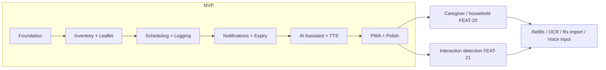

# ECZAM — Feature Backlog

> The prioritized catalog of features (`FEAT-##`): MVP features (mapped to phases and
> FRs) and post-MVP bets, with value, effort, status, dependencies, and rationale.

**Status:** Draft · **Owner:** Product · **Last updated:** 2026-06-18
**Related:** [mvp-definition.md](mvp-definition.md) · [functional-requirements.md](functional-requirements.md) · [user-stories.md](user-stories.md) · [vision-document.md](vision-document.md)

---

## Legend

- **Priority:** **M** Must · **S** Should · **C** Could · **F** Future (post-MVP)
- **Effort:** T-shirt size (XS/S/M/L/XL)
- **Status:** Planned · In progress · Done (update as work proceeds)
- **Value:** business/user value (Low/Med/High)

---

## MVP features

| ID | Feature | Phase | Priority | Value | Effort | FRs | Status |
|---|---|---|---|---|---|---|---|
| **FEAT-01** | Email/password auth + JWT sessions | 1 | M | High | M | FR-001…003 | Planned |
| **FEAT-02** | Password reset via email | 1 | M | Med | S | FR-004 | Planned |
| **FEAT-03** | Profile & notification preferences | 1 | M | Med | S | FR-005,006 | Planned |
| **FEAT-04** | App shell, routing, AuthContext, protected routes | 1 | M | High | M | (foundation) | Planned |
| **FEAT-05** | Medication catalog storage + CRUD | 2 | M | High | M | FR-010,011,015 | Planned |
| **FEAT-06** | Barcode scanning + lookup + auto-fill | 2 | M | High | L | FR-012,080…083 | Planned |
| **FEAT-07** | OpenFDA fallback + background ingestion trigger | 2 | S | Med | M | FR-013,014 | Planned |
| **FEAT-08** | Personal inventory CRUD | 2 | M | High | M | FR-020…023 | Planned |
| **FEAT-09** | Low-stock + expiry status indicators | 2 | M | High | S | FR-024,026 | Planned |
| **FEAT-10** | Expiry-batch (multi-entry) support | 2 | S | Med | S | FR-025 | Planned |
| **FEAT-11** | Leaflet viewer (sections + full-text search) | 2/5 | M | High | M | FR-060,061,015 | Planned |
| **FEAT-12** | Dose scheduling (daily/weekly/interval, pause/resume) | 3 | M | High | L | FR-030…036 | Planned |
| **FEAT-13** | One-tap dose logging + atomic decrement | 3 | M | High | M | FR-040…043 | Planned |
| **FEAT-14** | Consumption history (filterable) | 3 | M | Med | S | FR-044,045 | Planned |
| **FEAT-15** | Push subscription + service worker push handler | 4 | M | High | L | FR-090,101 | Planned |
| **FEAT-16** | Background scheduler (dose reminders, low-stock) | 4 | M | High | L | FR-091,092,095 | Planned |
| **FEAT-17** | Expiration monitoring jobs + Expiration page | 4 | M | High | M | FR-050…054,093 | Planned |
| **FEAT-18** | Optional email reminders | 4 | S | Med | S | FR-094 | Planned |
| **FEAT-19** | RAG AI assistant (grounded, cited, streaming) | 5 | M | High | XL | FR-070…077 | Planned |
| **FEAT-19a** | Leaflet ingestion pipeline (pgvector) | 5 | M | High | L | FR-060, UC-010 | Planned |
| **FEAT-19b** | Text-to-speech leaflet playback | 5 | M | High | M | FR-062…064 | Planned |
| **FEAT-19c** | Dashboard (today's doses, low stock, expiry) | 6 | M | High | M | FR-103,FR-050,024 | Planned |
| **FEAT-19d** | PWA installability + offline + caching | 6 | M | High | M | FR-100,102, NFR-070…072 | Planned |
| **FEAT-19e** | Accessibility audit + responsive QA | 6 | M | High | M | NFR-010…015 | Planned |

## Post-MVP bets — *brief §14*

| ID | Feature | Priority | Value | Effort | Depends on | Rationale |
|---|---|---|---|---|---|---|
| **FEAT-20** | Multi-user / family / caregiver accounts (shared household pharmacy) | F | High | XL | Auth, inventory | Unlocks the caregiver (P3) vision; biggest reach expansion |
| **FEAT-21** | Medication interaction detection | F | High | L | Catalog, leaflet data | Major safety value; needs a reliable interactions data source |
| **FEAT-22** | OCR medication-box photo recognition | F | Med | L | Catalog | Faster capture when no barcode; depends on OCR accuracy |
| **FEAT-23** | Prescription import | F | Med | XL | Catalog, integrations | Onboarding speed; depends on external prescription sources |
| **FEAT-24** | Smart refill recommendations | F | Med | M | Logging, scheduling | Predict run-out from consumption trends |
| **FEAT-25** | National medication DB integrations beyond OpenFDA | F | Med | L | Catalog | Richer/local catalog (e.g. Turkish sources) for the TR market |
| **FEAT-26** | Voice **input** (microphone) to the AI assistant | F | Med | M | AI assistant | Completes hands-free use; TTS output already ships in MVP |

## Prioritization rationale

- **Value vs effort:** MVP prioritizes high-value capabilities that prove the core
  loop (inventory ↔ scheduling ↔ logging ↔ notifications) before higher-effort
  differentiators (RAG assistant). The assistant (FEAT-19, XL) is sequenced last in
  MVP because it depends on a populated, ingested leaflet corpus.
- **Dependencies first:** foundation (FEAT-01…04) and catalog/inventory
  (FEAT-05…11) unblock everything else.
- **Deferred-but-strategic:** FEAT-20 (caregiver accounts) and FEAT-21 (interaction
  detection) carry the most long-term value but are large and data-dependent, so
  they are post-MVP per [mvp-definition.md](mvp-definition.md).

## Roadmap snapshot

