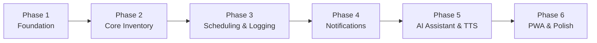

# ECZAM — MVP Definition

> The precise boundary of the Minimum Viable Product: what's in, what's out, the
> phased build plan with exit criteria, and what "done" means.

**Status:** Draft · **Owner:** Product/Eng · **Last updated:** 2026-06-18
**Related:** [product-requirements-document.md](product-requirements-document.md) · [functional-requirements.md](functional-requirements.md) · [user-stories.md](user-stories.md) · [feature-backlog.md](feature-backlog.md) · [test-plan.md](test-plan.md)

---

## 1. MVP goal

A single user can manage their entire personal medication lifecycle end to end:
add medicines (barcode or manual), schedule and log doses with automatic inventory
decrement, receive dose/low-stock/expiry notifications, read or listen to leaflets,
and ask a leaflet-grounded AI assistant — all from an installable, accessibility-first
PWA.

## 2. In scope (MVP)

The eight core capability areas, each tied to its FR group:

| Capability | Summary | FRs |
|---|---|---|
| Authentication | Email/password, JWT, password reset, preferences | FR-001…006 |
| Medication catalog | Catalog storage, manual + barcode create, OpenFDA fallback | FR-010…015 |
| Inventory | CRUD, low-stock + expiry indicators, expiry batches | FR-020…026 |
| Scheduling | Daily/weekly/interval schedules, pause/resume, all-schedules view | FR-030…036 |
| Dose logging | One-tap log, atomic decrement, immutable history | FR-040…045 |
| Expiration monitoring | Expiring-soon thresholds, expired flags, alerts, page | FR-050…054 |
| Leaflet + TTS | Structured sections, search, Web Speech TTS controls | FR-060…064 |
| AI assistant | RAG, grounded/cited answers, decline-and-refer, streaming | FR-070…077 |
| Barcode scanning | Camera scan → lookup → auto-fill, graceful fallback | FR-080…083 |
| **Cross-cutting** | Notifications (push + optional email), PWA, dashboard | FR-090…103 |

## 3. Out of scope (MVP) — *brief §14*

Explicitly **not** built for MVP; tracked as future bets in
[feature-backlog.md](feature-backlog.md):

| Deferred capability | Backlog ID |
|---|---|
| Multi-user / family / caregiver accounts (shared household pharmacy) | FEAT-20 |
| Medication interaction detection | FEAT-21 |
| OCR-based medication-box photo recognition | FEAT-22 |
| Prescription import | FEAT-23 |
| Smart refill recommendations | FEAT-24 |
| National medication DB integrations beyond OpenFDA | FEAT-25 |
| Microphone voice **input** to the AI (TTS **output** is in scope) | FEAT-26 |

> MVP is **single-user**. A caregiver (P3) operates ECZAM as the patient's account
> until caregiver accounts ship post-MVP.

## 4. Definition of Done (MVP)

The MVP is complete when **all** of the following hold:

- All **Must** (M) user stories in [user-stories.md](user-stories.md) pass their
  acceptance criteria.
- The walking skeleton (§6) runs end to end on a clean environment.
- NFR gates met: WCAG 2.1 AA (axe + manual), functional at 375px, all Lighthouse
  PWA checks pass, non-AI p95 < 300ms, AI TTFT < 2s (see
  [non-functional-requirements.md](non-functional-requirements.md)).
- Test gates met: unit tests for all service-layer logic; integration tests for all
  endpoints; the RAG grounding eval suite passes (see [test-plan.md](test-plan.md)).
- KVKK controls in place (consent, data-subject rights, encryption, secrets in env)
  per [security-requirements.md](security-requirements.md).
- The MVP demo script (§7) can be completed without manual workarounds.

## 5. Phased delivery plan

Each phase is a **fully working vertical slice** before the next begins (brief §12).

### Phase 1 — Foundation
- Scaffolding (monorepo: `backend/` Spring Boot + `frontend/` React), DB schema via
  Flyway, registration/login/JWT (issue + refresh), auth filter / protected-route
  guard, React app shell with routing + AuthContext.
- **Exit criteria:** a user can register, log in, stay signed in, and reach a
  protected dashboard shell. *(EP-01)*

### Phase 2 — Core Inventory
- Catalog CRUD (backend), inventory CRUD (backend), inventory list page, Add form
  (manual + barcode scan), medication detail page with leaflet viewer (sections,
  search).
- **Exit criteria:** a user can add (manual + barcode), view, edit, delete inventory,
  and browse a leaflet. *(EP-02, EP-07 read path)*

### Phase 3 — Scheduling & Logging
- Schedule create/manage (backend + frontend), dose-logging endpoint with atomic
  decrement, dose-log history page.
- **Exit criteria:** a user can schedule a medication, log a dose in one tap with
  inventory decrement, and view history. *(EP-03, EP-04)*

### Phase 4 — Notifications
- Push subscription registration, service worker with push handler, background
  scheduler (dose reminders + low-stock), expiration jobs + Expiration page.
- **Exit criteria:** a user receives dose, low-stock, and expiry notifications and
  sees the Expiration page. *(EP-05, EP-06)*

### Phase 5 — AI Assistant & TTS
- pgvector setup + leaflet ingestion pipeline, RAG query endpoint with SSE streaming,
  AI chat page, TTS controls on the medication detail page.
- **Exit criteria:** a user gets grounded, cited, streamed answers and can hear any
  leaflet section read aloud. *(EP-07 TTS, EP-08)*

### Phase 6 — PWA & Polish
- Service-worker caching strategy, Web App Manifest, offline fallback, accessibility
  audit + fixes, responsive QA, dashboard.
- **Exit criteria:** installable PWA passing Lighthouse PWA + accessibility gates;
  dashboard summarizes today's doses, low stock, and expiry. *(EP-09, FR-100…103)*

## 6. Walking skeleton

The thinnest end-to-end slice proving the architecture, delivered within Phases 1–3:

> Register → log in → add one medication (manual) → create a daily schedule → log a
> dose → see inventory decrement and the log entry.

This exercises auth, catalog, inventory, scheduling, logging, the atomic-decrement
invariant, and the React↔Spring Boot↔Postgres path before notifications/AI are added.

## 7. MVP demo script (sign-off)

1. Register a new account; grant push permission.
2. Add a medication by **barcode** (show OpenFDA fallback + auto-fill); add a second
   medication **manually**.
3. Create a daily schedule at the next minute boundary.
4. Receive the **dose reminder** push; tap "Mark as taken" → show inventory
   decrement and the new **log** entry.
5. Lower a medication to its threshold → show the **low-stock** alert.
6. Add an item expiring within the window → show it on the **Expiration** page and the
   expiry alert.
7. Open a medication → **search** the leaflet and **play a section via TTS**.
8. Ask the **AI assistant** an answerable question (grounded + cited), then an
   unanswerable one (declines + refers).
9. Show the app **installed** as a PWA and the **dashboard** summarizing today.

## 8. Explicit MVP assumptions

- A seed leaflet corpus exists or is obtainable at ingestion time (manual / OpenFDA).
- API keys for the LLM and embeddings are configured (env vars).
- Target browsers support service workers, Web Push, Web Speech, and camera access.
