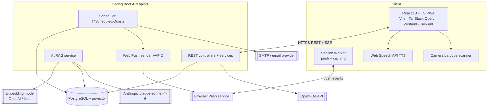
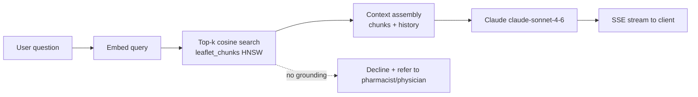
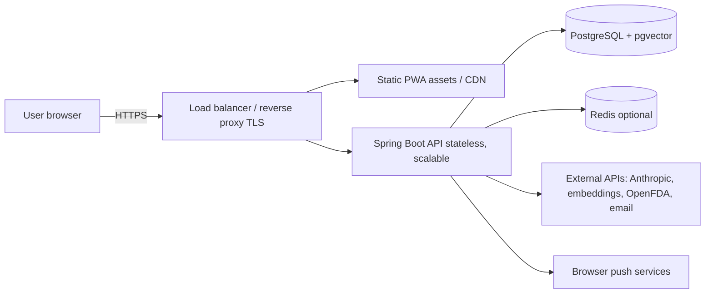

# ECZAM — System Architecture

> The technical architecture of ECZAM: components, the Spring Boot backend, the React
> PWA frontend, the scheduler, the AI/RAG subsystem, notifications, cross-cutting
> concerns, and key decisions.

**Status:** Draft · **Owner:** Eng · **Last updated:** 2026-06-18
**Related:** [database-design.md](database-design.md) · [api-specification.md](api-specification.md) · [security-requirements.md](security-requirements.md) · [non-functional-requirements.md](non-functional-requirements.md)

> **Stack note.** The brief suggested a Node/NestJS or Rust/Axum backend. ECZAM uses
> **Spring Boot + PostgreSQL** instead. The brief's REST contract, DB schema, RAG
> pipeline, and notification design are preserved verbatim; only the implementation
> framework differs. The brief's TypeScript module layout maps 1:1 onto Spring
> packages (controller/service/repository/entity/dto/mapper).

---

## 1. Architectural overview

ECZAM is a classic three-tier web system: a React PWA client, a stateless Spring Boot
REST API, and a PostgreSQL (+pgvector) datastore — augmented by a background
scheduler and integrations with external AI, drug-label, and push services.



### 1.1 Context (C4 level 1)

| External actor/system | Relationship |
|---|---|
| User (P1–P4) | Uses the PWA over HTTPS |
| Anthropic API | Synthesizes grounded assistant answers (`claude-sonnet-4-6`) |
| Embedding model | Embeds leaflet chunks & queries (OpenAI `text-embedding-3-small` or local) |
| OpenFDA | Barcode/label lookup fallback |
| Browser push service | Delivers Web Push notifications |
| Email provider | Optional email reminders |

## 2. Backend architecture (Spring Boot)

**Runtime:** Java 21, Spring Boot 3.2+, Maven. **Web:** Spring Web (MVC).
**Persistence:** Spring Data JPA / Hibernate over PostgreSQL; Flyway migrations.
**Security:** Spring Security + JWT. **Validation:** Bean Validation (Jakarta).
**Mapping:** MapStruct. **API docs:** springdoc-openapi.

### 2.1 Package layout (per domain)

Mirrors the brief's module structure (auth, users, medications, inventory, reminders,
expiration, notifications, ai, integrations, shared):

```
com.eczam
├── auth/         AuthController, AuthService, dto/, security/
├── users/        UserController, UserService, UserRepository, User (entity), dto/, mapper/
├── medications/  catalog CRUD, barcode lookup, leaflet read
├── inventory/    user_medications CRUD, low-stock logic
├── reminders/    schedules CRUD, schedule evaluation
├── expiration/   expiry queries + page data
├── notifications/
│   └── push/     WebPushSender, subscription mgmt, VAPID config
├── ai/
│   ├── ChatController        (SSE streaming endpoint)
│   ├── RagService            (embed → vector search → LLM)
│   └── LeafletIndexer        (ingestion at catalog insert time)
├── integrations/
│   └── barcode/  OpenFdaClient
└── shared/
    ├── web/      response envelope, GlobalExceptionHandler, pagination
    ├── security/ JwtFilter, SecurityConfig, guards
    └── config/   beans, scheduler config, properties
```

Each domain follows: **controller** (HTTP, validation, response shaping) → **service**
(business logic) → **repository** (JPA) → **entity** (JPA mapping) → **dto** (records +
validation) → **mapper** (MapStruct entity↔DTO).

### 2.2 Request lifecycle & API conventions

- All routes under **`/api/v1`**.
- Uniform response envelope **`{ data, meta, error }`** via a response wrapper +
  `GlobalExceptionHandler` (`@RestControllerAdvice`).
- **Cursor-based pagination** on all list endpoints (`meta.nextCursor`).
- Validation failures → **422** with field-level errors.
- Authenticated endpoints require `Authorization: Bearer <JWT>`, enforced by a
  `JwtFilter` in the Spring Security chain.
- See [api-specification.md](api-specification.md) for the full contract.

### 2.3 Persistence notes

PostgreSQL with pgvector; JPA entities map the brief's schema (UUID PKs,
`TIMESTAMPTZ`, JSONB for preferences/leaflet sections, `TIME[]`/`SMALLINT[]` arrays
for schedules, `vector(1536)` for embeddings). Details and entity-mapping guidance:
[database-design.md](database-design.md).

## 3. Scheduler subsystem

The Node-stack brief used Bull + Redis; the Spring equivalent is a **`@Scheduled`
fixed-rate job (1 minute)**, upgradeable to **Quartz** (for clustered/persistent
jobs) if multi-instance scheduling is needed. Redis remains optional.

Each tick (per brief §7.1):

1. Query active schedules whose next scheduled time falls in the current minute
   window → emit `DOSE_REMINDER`.
2. Query `user_medications` where `quantity <= low_stock_threshold` → emit `LOW_STOCK`.
3. Query `user_medications` expiring within `expiry_warning_days` → emit
   `EXPIRY_WARNING`; past expiry → `EXPIRED`.

Idempotency: each tick tracks what it has already sent in the window to avoid
duplicate notifications (NFR-020). For horizontal scaling, use a single leader
(ShedLock or Quartz clustering) so only one instance runs the tick.

## 4. AI / RAG subsystem — *brief §8*

Two pipelines: **ingestion** (once, when a catalog medication is added) and **query**
(per user question).

### 4.1 Ingestion (`LeafletIndexer`) — UC-010

```
raw leaflet text → section splitter → ~300-token overlapping chunks
  → embedding model → store (chunk_text, embedding, medication_id, section_name, chunk_index)
  → set medications.vector_indexed = true
```

### 4.2 Query (`RagService`) — UC-009



- Embed the query with the **same model** used at ingestion.
- Top-5 chunks by cosine similarity, optionally filtered by `medication_id`.
- Assemble retrieved chunks + conversation history into the prompt.
- Call the LLM and **stream** tokens to the client via **Server-Sent Events (SSE)**
  (Spring `SseEmitter` / `Flux<ServerSentEvent>` with WebFlux, or `ResponseBodyEmitter`
  on MVC).
- **Integration option:** Spring AI's Anthropic + vector-store abstractions, or a
  direct HTTP client to the Anthropic API. Either is acceptable; keep the boundary
  behind `RagService`.

### 4.3 Grounding system prompt (verbatim from brief §8.4)

```
You are ECZAM Assistant, a medication information helper embedded in the ECZAM platform.
You answer questions strictly based on the medication leaflet passages provided to you in the context.
Do not speculate beyond what the passages say. Do not provide general medical advice.
If a question cannot be answered from the provided passages, say so clearly and suggest the user consult their pharmacist or physician.
Always cite which section of the leaflet your answer comes from.
Respond in the same language the user writes in.
```

Guardrails: leaflet-grounded only, citations required, decline-and-refer when
ungrounded, language-matching — enforced by FR-072…075 and tested in
[test-plan.md](test-plan.md).

## 5. Notification subsystem — *brief §7*

- **Web Push:** the backend sends Web Push via a Java library (e.g.
  `nl.martijndwars:web-push`) using **VAPID** keys from environment variables.
  Subscriptions are stored in `push_subscriptions`.
- **Email (optional):** Spring Mail (or a transactional provider) sends reminders only
  when `notification_preferences.email = true`.
- **Service worker (frontend):** registered at startup; handles background `push`
  events and renders notifications (with the "Mark as taken" action → logs a dose).

Notification types: `DOSE_REMINDER`, `LOW_STOCK`, `EXPIRY_WARNING`, `EXPIRED`
(payloads per brief §7.3).

## 6. Frontend architecture (React PWA) — *brief §4*

- **Stack:** React 18 + TypeScript, Vite, React Router v6, TanStack Query (server
  state), Zustand (client state), Tailwind CSS.
- **Structure:** `components/`, `pages/` (Dashboard, Inventory, MedicationDetail,
  Schedules, Logs, Expiration, AiAssistant, Login, Register), `features/`
  (medications, reminders, inventory, expiration, ai-assistant), `services/` (Axios
  instance, API calls, push registration), `hooks/` (`useTTS`, `useBarcode`,
  `useNotifications`), `contexts/` (Auth, Notification), `routes/` (protected route
  wrapper), `utils/`.
- **PWA:** Vite PWA plugin service worker, Web App Manifest (icons, theme color,
  display mode), Web Push subscription stored on the backend.
- **TTS:** `useTTS` hook wrapping `SpeechSynthesisUtterance` (Web Speech API) — no
  external service (brief §10).
- **Barcode:** `@zxing/library` or `html5-qrcode` in a viewfinder modal (brief §9.1).
- **Accessibility:** WCAG 2.1 AA, scalable fonts, keyboard focus, keyboard-operable
  TTS (see [non-functional-requirements.md](non-functional-requirements.md)).

## 7. Cross-cutting concerns

| Concern | Approach |
|---|---|
| **Configuration** | All secrets/config via env vars (brief §11): `DATABASE_URL`, `JWT_SECRET`, `VAPID_*`, `ANTHROPIC_API_KEY`, `OPENAI_API_KEY`, `REDIS_URL`, SMTP_*. Spring `@ConfigurationProperties`. |
| **Error handling** | `GlobalExceptionHandler` maps exceptions → `{error}` envelope with codes; validation → 422 field errors. |
| **Security** | TLS, bcrypt, JWT, CORS, parameterized JPA queries, input validation. See [security-requirements.md](security-requirements.md). |
| **Logging/metrics** | Structured logs with correlation IDs (no PII); Actuator metrics + health probes (NFR-060…062). |
| **Transactions** | Dose logging + decrement is a single `@Transactional` unit (NFR-021). |
| **Testing** | JUnit 5 + Spring Boot Test + Testcontainers (Postgres); Vitest + Testing Library; Playwright E2E ([test-plan.md](test-plan.md)). |

## 8. Deployment topology



- The API is **stateless** (JWT) and horizontally scalable (NFR-030); the scheduler
  runs as a single leader.
- Frontend is static, CDN-served, installable as a PWA.
- One PostgreSQL with the `vector` extension serves both relational and vector data.

## 9. Key architecture decisions (ADRs, summary)

| ADR | Decision | Rationale |
|---|---|---|
| **ADR-1** | Spring Boot + PostgreSQL backend (over the brief's Node/Rust) | Team/stack preference; mature ecosystem, JPA, Spring Security, strong typing |
| **ADR-2** | Single PostgreSQL with **pgvector** for relational + vector data | One datastore; transactional consistency; HNSW search; avoids a separate vector DB |
| **ADR-3** | RAG **strictly grounded** in leaflet chunks; decline-and-refer | Safety/trust (P5); no general medical advice |
| **ADR-4** | **SSE** for assistant streaming | Simple, one-way streaming fits token output; works through proxies |
| **ADR-5** | `@Scheduled`/Quartz with single-leader (over Bull+Redis) | Stays in the Spring stack; Redis optional, not required at MVP scale |
| **ADR-6** | **Monorepo** (`backend/` + `frontend/`) | Shared docs/versioning; simpler MVP coordination |
| **ADR-7** | **Flyway** migrations (over Prisma) | SQL-first, matches the brief's authoritative SQL schema |
| **ADR-8** | **PWA**, not native | No app-store barrier; reaches the highest-risk users (brief §1) |

Detailed, individually-numbered ADRs can be expanded under `docs/adr/` as decisions
evolve.
