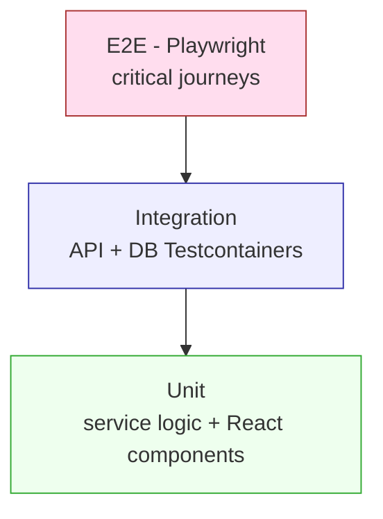

# ECZAM — Test Plan

> The testing strategy: the test pyramid, coverage goals, tooling, specialized tests
> (RAG, scheduler, barcode, security, KVKK), NFR verification, CI gating, and a
> requirement→test traceability matrix.

**Status:** Draft · **Owner:** Eng/QA · **Last updated:** 2026-06-18
**Related:** [functional-requirements.md](functional-requirements.md) · [non-functional-requirements.md](non-functional-requirements.md) · [use-cases.md](use-cases.md) · [security-requirements.md](security-requirements.md) · [mvp-definition.md](mvp-definition.md)

---

## 1. Objectives

- Verify every **Must** functional requirement and user story.
- Meet the brief's coverage mandate: **unit tests for all service-layer business
  logic; integration tests for all API endpoints** (NFR-080/081).
- Verify NFR targets (performance, accessibility, PWA, security).
- Guarantee the safety-critical behaviors: **atomic dose logging**, **notification
  correctness**, and **AI grounding**.

## 2. Test pyramid

| Layer | Scope | Tooling |
|---|---|---|
| **Backend unit** | Service-layer business logic (no DB) | JUnit 5, Mockito, AssertJ |
| **Backend integration** | Controllers + services + real Postgres | Spring Boot Test, **Testcontainers (Postgres+pgvector)**, MockMvc/WebTestClient, REST-assured |
| **Frontend unit/component** | Hooks, components, state | **Vitest**, React Testing Library |
| **Contract** | API envelope, status codes, pagination | springdoc/OpenAPI assertions; schema checks |
| **E2E** | Cross-stack user journeys | **Playwright** |
| **Non-functional** | a11y, performance, PWA, security | axe, Lighthouse, k6/Gatling, OWASP tools |

## 3. Backend unit tests (service layer) — NFR-080

Priority business logic to cover:

- **Dose logging & decrement (FR-040…043):** quantity decremented by dose; never
  negative; insufficient-stock rejected; log fields correct.
- **Scheduling (FR-030…036):** daily/weekly/interval "is-due" computation; days-of-
  week filtering; interval "every N days" from `starts_on`; pause excludes from due
  set; start/end-date boundaries.
- **Low-stock logic (FR-024):** threshold comparison against per-user preference.
- **Expiry windows (FR-050…052):** expiring-soon within `expiry_warning_days`;
  expired detection; threshold overrides.
- **Auth (FR-001…004):** registration validation, bcrypt hashing, JWT issue/verify,
  reset-token single-use/expiry.
- **RAG assembly (FR-071…074):** context assembly, citation extraction, grounded vs
  ungrounded decision (with a mocked LLM/embedder).

## 4. Backend integration tests (every endpoint) — NFR-081

Against a Testcontainers Postgres with pgvector and Flyway-applied schema:

- Every endpoint in [api-specification.md](api-specification.md): success + key error
  paths (401/403/404/409/422).
- **Envelope & pagination** consistency (`{data,meta,error}`, cursor) (NFR-051/031).
- **Atomicity** of `POST /medication-logs` (log + decrement in one transaction);
  concurrency test that two simultaneous logs don't oversell stock (NFR-021).
- **Authorization / IDOR:** user A cannot read/modify user B's resources (SEC-A04).
- **Barcode endpoint:** local hit; OpenFDA fallback (mocked) → catalog create +
  ingestion trigger; total miss → 404 (UC-002).

## 5. Frontend tests

- **Component/unit (Vitest + RTL):** Add Medication form (manual + scan paths),
  inventory list (low-stock + expiry badges), schedule form (frequency variants),
  one-tap log, dashboard summary.
- **Hooks:** `useTTS` (play/pause/stop lifecycle, voice fallback), `useBarcode`,
  `useNotifications`.
- **State:** TanStack Query cache behavior; Zustand stores; AuthContext route
  protection.
- **PWA:** service-worker registration, manifest presence, offline fallback render.

## 6. End-to-end journeys (Playwright)

Mapped to use cases; these mirror the MVP demo script ([mvp-definition.md](mvp-definition.md) §7):

| E2E | Journey | Use case |
|---|---|---|
| E2E-1 | Register → login → reach dashboard | UC-001 |
| E2E-2 | Add med by barcode (mock OpenFDA) + manually | UC-002, UC-003 |
| E2E-3 | Create schedule → log dose → see decrement + history | UC-004, UC-005 |
| E2E-4 | Receive dose reminder (mock push) → "Mark as taken" | UC-006 |
| E2E-5 | Low-stock + expiry surfaced on dashboard/Expiration page | UC-007 |
| E2E-6 | Leaflet search + TTS playback | UC-008 |
| E2E-7 | AI assistant: grounded+cited answer, then declined answer | UC-009 |

## 7. Specialized tests

### 7.1 RAG / AI grounding evaluation (NFR-082)
- **Grounded answers:** for seeded leaflets, known questions return answers traceable
  to the retrieved chunk, with a **citation** to the correct section (FR-074).
- **Decline-and-refer:** out-of-leaflet / general-medical questions are **declined**
  with a pharmacist/physician referral (FR-073) — assert it does **not** fabricate.
- **Scope filter:** `medicationId` filter restricts retrieval (FR-077).
- **Language:** answers match the user's input language (TR/EN) (FR-075).
- **Prompt-injection:** malicious leaflet/user text cannot override guardrails
  (SEC-AI04).
- Run as a curated eval set in CI (mock or recorded LLM where deterministic).

### 7.2 Notification scheduler
- Due-schedule selection within the minute window; **no duplicate sends** per window
  (NFR-020); pause excludes; `LOW_STOCK`/`EXPIRY_WARNING`/`EXPIRED` triggers fire on
  the right conditions; single-leader behavior under multiple instances.

### 7.3 Barcode
- Decode → lookup → auto-fill; local hit, OpenFDA fallback, total miss → manual
  fallback; camera-denied path still allows manual entry (FR-080…083).

### 7.4 Security (see [security-requirements.md](security-requirements.md))
- AuthZ/IDOR, SQL-injection attempts (parameterized safety), input validation (422),
  rate limiting (429), no-account-enumeration on login/reset, no PII in logs,
  dependency scan (OWASP Dependency-Check).

### 7.5 KVKK data-rights
- Account deletion **cascades and erases** personal data (inventory, schedules, logs,
  subscriptions); data export returns the user's data; consent is recorded; rectify
  via profile edit (SEC-K01/04/05).

## 8. Non-functional verification

| NFR | Method |
|---|---|
| Performance p95 < 300ms (NFR-001) | k6/Gatling load test; assert p95 |
| AI TTFT < 2s (NFR-002) | Instrumented SSE timing on the chat endpoint |
| Accessibility WCAG 2.1 AA (NFR-010) | **axe** automated scan + manual keyboard/contrast audit |
| 375px viewport (NFR-011) | Playwright at 375px; responsive QA |
| Font scaling / zoom (NFR-012) | Manual at 200% zoom |
| Keyboard + TTS a11y (NFR-013) | Keyboard-only walkthrough incl. TTS controls |
| PWA installability (NFR-070) | **Lighthouse** PWA audit (all checks pass) |
| Caching strategy (NFR-072) | Service-worker offline/cache tests |

## 9. Test data strategy

- **Fixtures:** seeded users, catalog medications with structured leaflets, inventory
  with varied expiry/quantity, schedules covering each frequency type.
- **Seeded leaflet corpus** for deterministic RAG eval (with pre-computed or mocked
  embeddings).
- **External services mocked** in CI: OpenFDA, push service, email, and LLM/embeddings
  (with a small live smoke suite gated separately).
- **Isolation:** each integration test runs against a clean Testcontainers DB
  (per-class or transactional rollback).

## 10. CI gating (NFR-083)

A merge is blocked unless:

- backend unit + integration tests pass; frontend unit/component tests pass;
- coverage meets the service-layer/endpoint mandate (NFR-080/081);
- lint/format pass; dependency scan has no critical findings;
- the RAG grounding eval suite passes;
- (pre-release) E2E suite, Lighthouse PWA/a11y, and a security review pass.

## 11. Requirement → test traceability (summary)

| Area | FRs | Primary tests |
|---|---|---|
| Auth | FR-001…006 | Unit (auth), Integration (auth endpoints), E2E-1, KVKK |
| Catalog/Barcode | FR-010…015, 080…083 | Integration (barcode), Unit, E2E-2 |
| Inventory | FR-020…026 | Unit (low-stock), Integration, Frontend (badges), E2E-2/5 |
| Scheduling | FR-030…036 | Unit (is-due), Integration, E2E-3 |
| Logging | FR-040…045 | Unit + Integration (atomicity/concurrency), E2E-3 |
| Expiration | FR-050…054 | Unit (windows), Scheduler, E2E-5 |
| Leaflet/TTS | FR-060…064 | Frontend (`useTTS`), Integration (search), E2E-6 |
| AI assistant | FR-070…077 | RAG eval, Integration (SSE), E2E-7 |
| Notifications/PWA | FR-090…103 | Scheduler, Frontend (SW), Lighthouse, E2E-4 |

The full Persona→Story→FR→Use Case→Feature→Test matrix lives in
[README.md](README.md).
