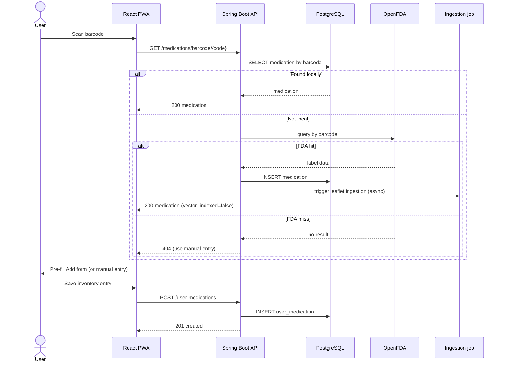
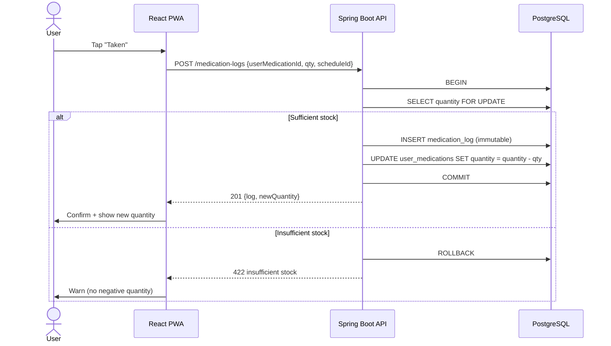
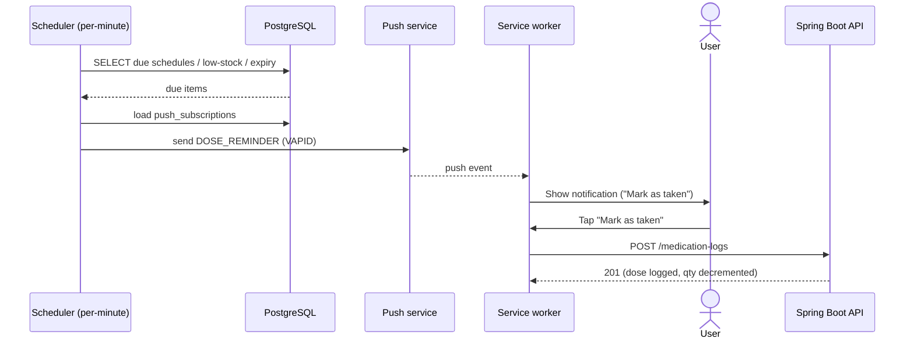

# ECZAM — Use Cases

> Detailed use cases (`UC-###`) for the primary flows: actors, preconditions, main
> flow, alternate/exception flows, postconditions. Non-trivial flows include a
> Mermaid sequence diagram.

**Status:** Draft · **Owner:** Product/Eng · **Last updated:** 2026-06-18
**Related:** [user-stories.md](user-stories.md) · [functional-requirements.md](functional-requirements.md) · [api-specification.md](api-specification.md) · [system-architecture.md](system-architecture.md)

---

## Actors

| Actor | Description |
|---|---|
| **User** | Authenticated ECZAM user (any of P1–P4) |
| **Visitor** | Unauthenticated person (pre-registration) |
| **Scheduler** | Backend per-minute background job |
| **OpenFDA** | External drug-label API (barcode fallback) |
| **Embedding model** | OpenAI/local model producing vectors |
| **LLM** | Anthropic `claude-sonnet-4-6` (assistant) |
| **Push service** | Browser push service (Web Push/VAPID) |

## Use-case index

| ID | Use case | Primary actor | FRs |
|---|---|---|---|
| UC-001 | Register & log in | Visitor | FR-001…004 |
| UC-002 | Add medication via barcode (OpenFDA fallback) | User | FR-012,013,080,081 |
| UC-003 | Add medication manually | User | FR-011,014,020,082 |
| UC-004 | Create a dose schedule | User | FR-030…032 |
| UC-005 | Log a dose (auto-decrement) | User | FR-040…043 |
| UC-006 | Receive & act on a dose reminder | Scheduler / User | FR-091,101,040 |
| UC-007 | Review expiring medications | User | FR-050…054 |
| UC-008 | Search a leaflet & listen (TTS) | User | FR-060…064 |
| UC-009 | Ask the AI assistant (RAG) | User | FR-070…077 |
| UC-010 | Leaflet ingestion (vector indexing) | System | FR-060, brief §8.2 |

---

## UC-001 — Register & log in

- **Primary actor:** Visitor → User
- **Preconditions:** None.
- **Postconditions:** A `users` row exists; the client holds a valid JWT.

**Main flow**
1. Visitor opens ECZAM and chooses Register.
2. Visitor submits email + password.
3. System validates input, hashes the password (bcrypt), creates the user, issues a
   JWT, and signs the visitor in.
4. System prompts for push permission (→ UC-006 setup) and lands on the dashboard.

**Alternate / exception flows**
- *2a. Email already registered* → 409/422 field error; no account created.
- *2b. Invalid input* (bad email, weak password) → 422 with field-level errors.
- *Login path:* existing user submits credentials → valid → JWT issued; invalid →
  401 non-enumerating error.
- *Forgot password:* user requests reset → emailed single-use, time-limited link →
  sets new password; expired/used link → rejected.

## UC-002 — Add medication via barcode (with OpenFDA fallback)

- **Primary actor:** User · **Supporting:** OpenFDA, (background) ingestion
- **Preconditions:** Authenticated; camera available & permitted.
- **Postconditions:** A catalog `medications` row exists; an Add form is pre-filled
  (and, on save, a `user_medications` entry is created).

**Main flow**
1. User opens Add Medication and starts the scanner (viewfinder + overlay).
2. User scans; the library decodes the barcode value.
3. Client sends the code to the backend lookup endpoint.
4. Backend finds it in the local catalog and returns the medication.
5. Client pre-fills the Add form; user sets quantity/unit/expiry and saves.

**Alternate / exception flows**
- *4a. Not in local catalog* → backend queries OpenFDA; on hit it creates the catalog
  record, **triggers background leaflet ingestion (UC-010)**, and returns the
  populated medication.
- *4b. Not found anywhere* → 404; client falls back to manual entry (UC-003).
- *1a. Camera denied/unavailable* → user proceeds with manual entry (UC-003).



## UC-003 — Add medication manually

- **Primary actor:** User
- **Preconditions:** Authenticated.
- **Postconditions:** Catalog medication (if new) + a `user_medications` entry exist.

**Main flow**
1. User opens Add Medication and chooses manual entry.
2. User enters medication details (name, manufacturer, form, strength, etc.) and
   stock details (quantity, unit, expiry, notes).
3. System creates/links the catalog medication and creates the inventory entry.

**Alternate / exception flows**
- *2a. Validation fails* → 422 field errors; nothing saved.
- *2b. Same medication + same expiry already in inventory* → uniqueness conflict
  surfaced (suggest editing the existing entry).

## UC-004 — Create a dose schedule

- **Primary actor:** User
- **Preconditions:** Authenticated; the inventory entry exists.
- **Postconditions:** A `medication_schedules` row exists and feeds the scheduler.

**Main flow**
1. User opens an inventory entry and chooses Add Schedule.
2. User sets dosage amount, frequency type (daily/weekly/interval), frequency value,
   time(s) of day, optional days-of-week, start date, optional end date.
3. System validates and saves the schedule (active by default).

**Alternate / exception flows**
- *2a. Invalid combination* (e.g. weekly with no days, interval with no N) → 422.
- *Later:* user pauses/resumes/edits/deletes the schedule (FR-033…035).

## UC-005 — Log a dose (with automatic decrement)

- **Primary actor:** User
- **Preconditions:** Authenticated; an inventory entry (and usually a schedule)
  exists.
- **Postconditions:** An immutable `medication_logs` row exists; the inventory
  quantity is decremented atomically.

**Main flow**
1. User taps "Taken" (from a reminder, the medication detail screen, or the
   dashboard).
2. System opens a transaction: inserts the dose log (timestamp, quantity used,
   linked schedule) and decrements `user_medications.quantity`.
3. System commits and confirms; the UI reflects the new quantity.

**Alternate / exception flows**
- *2a. Insufficient stock* → warn the user; do not allow quantity below zero
  (FR-043).
- *2b. Resulting quantity ≤ low-stock threshold* → flag low stock and let the
  scheduler emit `LOW_STOCK` (UC-006 family).



## UC-006 — Receive & act on a dose reminder

- **Primary actor:** Scheduler → User
- **Preconditions:** User has an active schedule and a stored push subscription.
- **Postconditions:** A push notification is delivered; acting on it can log a dose
  (UC-005).

**Main flow**
1. Each minute, the Scheduler queries active schedules whose next time falls in the
   current minute window (also low-stock and expiry queries — UC-007).
2. For each due schedule, the system builds a `DOSE_REMINDER` payload (medication,
   dosage, "Mark as taken" action) and sends Web Push (and email if enabled).
3. The browser/service worker displays the notification.
4. User taps "Mark as taken" → triggers UC-005.

**Alternate / exception flows**
- *2a. No valid push subscription* → fall back to email (if enabled) and the in-app
  today view.
- *2b. Push send fails / subscription expired* → mark subscription stale; surface
  in-app.



## UC-007 — Review expiring medications

- **Primary actor:** User (with Scheduler producing alerts)
- **Preconditions:** Authenticated; inventory entries have expiration dates.
- **Postconditions:** User sees expiring/expired items; alerts may have been sent.

**Main flow**
1. User opens the Expiration page (or the dashboard expiry section).
2. System lists entries expiring within the user's `expiry_warning_days` and entries
   already expired (flagged).
3. User edits, deletes, or refills affected entries.

**Alternate / exception flows**
- *Background:* the Scheduler emits `EXPIRY_WARNING` (within window) and `EXPIRED`
  (past date) notifications (FR-053, FR-093).

## UC-008 — Search a leaflet & listen (TTS)

- **Primary actor:** User
- **Preconditions:** Authenticated; the medication has structured leaflet sections.
- **Postconditions:** User reads/hears the requested leaflet content.

**Main flow**
1. User opens a medication's detail page and the leaflet viewer.
2. User searches across sections (dosage, side effects, contraindications, storage,
   interactions, missed dose) and opens a matching section.
3. User selects a section and presses Play; the browser's Web Speech API reads it
   aloud. Pause/Stop control playback.

**Alternate / exception flows**
- *3a. No matching system-language voice* → fall back to the first available voice.
- *2a. No leaflet content* → show a clear "no leaflet available" state.
- *Accessibility:* all controls operable by keyboard (FR-064).

## UC-009 — Ask the AI assistant (RAG)

- **Primary actor:** User · **Supporting:** Embedding model, LLM
- **Preconditions:** Authenticated; relevant leaflet chunks are vector-indexed.
- **Postconditions:** A grounded, cited answer is streamed; conversation history is
  retained for the session.

**Main flow**
1. User types a question (optionally scoped to one medication).
2. System embeds the query, runs top-k cosine similarity search over `leaflet_chunks`
   (filtered by medication if specified).
3. System assembles retrieved chunks + conversation history into the prompt and calls
   the LLM with the grounding system prompt.
4. The answer streams to the UI (SSE), citing the leaflet section(s) used.

**Alternate / exception flows**
- *2a. No sufficiently similar chunk* → the assistant declines and suggests
  consulting a pharmacist/physician (FR-073), citing nothing it didn't retrieve.
- *3a. LLM/embedding failure* → graceful error; user can retry.
- *Language:* the answer is in the user's input language (FR-075).

```mermaid
sequenceDiagram
    actor User
    participant FE as React PWA
    participant API as Spring Boot API (RAG)
    participant EMB as Embedding model
    participant DB as PostgreSQL + pgvector
    participant LLM as Claude (claude-sonnet-4-6)

    User->>FE: Ask question
    FE->>API: POST /ai/chat (SSE)
    API->>EMB: embed(query)
    EMB-->>API: query vector
    API->>DB: top-k cosine search (filter by medication?)
    DB-->>API: leaflet chunks (+ section names)
    alt Relevant chunks found
        API->>LLM: system prompt + chunks + history + question (stream)
        LLM-->>API: tokens (stream)
        API-->>FE: SSE tokens (with citations)
        FE->>User: Streamed grounded answer
    else No grounding
        API-->>FE: "Can't answer from leaflet; consult pharmacist/physician"
    end
```

## UC-010 — Leaflet ingestion (vector indexing)

- **Primary actor:** System (triggered when a medication is added to the catalog)
- **Preconditions:** A `medications` row with raw leaflet text exists.
- **Postconditions:** `leaflet_chunks` rows with embeddings exist; `vector_indexed`
  is set true.

**Main flow**
1. Trigger: a new catalog medication is created (manual or via OpenFDA, UC-002).
2. Section splitter divides the raw leaflet into named sections.
3. Chunk generator produces overlapping ~300-token chunks per section.
4. Embedding model produces a vector per chunk.
5. System stores `(chunk_text, embedding, medication_id, section_name, chunk_index)`
   and sets `medications.vector_indexed = true`.

**Alternate / exception flows**
- *2a. Unstructured/missing leaflet* → store what is available; mark indexing
  incomplete so the assistant declines gracefully for that medicine.
- *4a. Embedding failure* → retry/back off; leave `vector_indexed = false`.

---

## Coverage

These use cases exercise every functional-requirement group and are the basis for
the integration and E2E scenarios in [test-plan.md](test-plan.md). See the
traceability matrix in [README.md](README.md).
