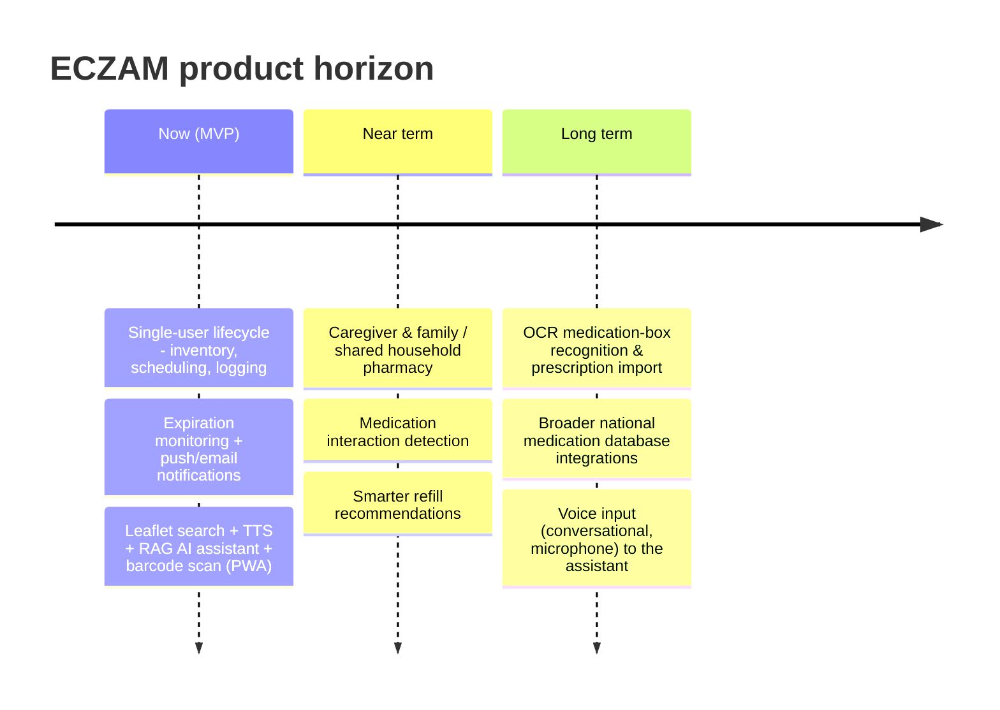

# ECZAM — Vision Document

> The long-term product vision and strategy for ECZAM: why it exists, what success
> looks like, and where it is headed beyond the MVP.

**Status:** Draft · **Owner:** Product · **Last updated:** 2026-06-18
**Related:** [problem-statement.md](problem-statement.md) · [product-requirements-document.md](product-requirements-document.md) · [mvp-definition.md](mvp-definition.md) · [feature-backlog.md](feature-backlog.md)

---

## 1. Vision statement

> **ECZAM is the digital medication companion that lets anyone — especially elderly
> and chronically ill people — manage every medicine they own safely, confidently,
> and without friction: knowing what to take, when to take it, how much is left,
> whether it is still safe to use, and exactly what it does.**

## 2. Mission

Replace the fragmented, error-prone, paper-and-memory routine of household
medication management with a single, accessible, voice-enabled digital assistant
that handles the full medication lifecycle — from adding a medicine to the
inventory, through scheduling and logging doses, to warning users about low stock
and expiry, and answering questions about each medicine in plain language.

## 3. The problem in the world today

Millions of people manage medications **reactively**: they take a pill when they
feel unwell, discover an empty box only at the pharmacy, and never read the leaflet
because it is printed in tiny font across many dense pages. The consequences fall
hardest on the people least able to absorb them:

- **Non-adherence** — missed or mistimed doses undermine treatment of chronic
  conditions.
- **Accidental misuse / overdose** — no reliable record of what was taken and when.
- **Expired medicines** — silently kept and used past their safe date.
- **Information inaccessibility** — leaflets are unreadable for those with poor
  eyesight or low health literacy.

See [problem-statement.md](problem-statement.md) for the full analysis.

## 4. Target outcomes

ECZAM is successful when, for its users, it measurably:

1. **Reduces missed doses** through timely, unambiguous reminders and one-tap
   logging.
2. **Prevents running out** of essential medication via low-stock alerts before the
   box is empty.
3. **Eliminates accidental use of expired medicine** through proactive expiry
   warnings and clear flags.
4. **Makes medication information understandable** by turning dense leaflets into a
   searchable, spoken, conversational experience.

## 5. Guiding principles

- **Accessibility is the product, not a feature.** Large, high-contrast, scalable
  text; minimal steps; WCAG 2.1 AA as a floor. Designed for poor eyesight and low
  digital literacy.
- **Voice as a first-class output.** Text-to-speech is built in, not bolted on.
- **No app-store barrier.** Delivered as a PWA — installable from the browser, with
  push notifications, no download, and no account required to begin exploring.
- **Grounded, honest information.** The AI assistant answers only from real leaflet
  content and never improvises medical advice.
- **Trust through safety.** Health data is treated as special-category personal
  data under KVKK; correctness and privacy are non-negotiable.

## 6. Product pillars

| Pillar | What it delivers |
|---|---|
| **Adherence** | Smart per-medication schedules + push/email reminders + one-tap dose logging |
| **Inventory** | Real-time stock counts auto-decremented on each dose, with low-stock alerts |
| **Expiration** | Proactive expiry warnings and active flags for already-expired stock |
| **Intelligent info** | Searchable, TTS-enabled leaflets + a RAG AI assistant grounded in them |

## 7. Success metrics

**North-star metric:** *medication adherence rate* — the percentage of scheduled
doses that are logged as taken within their expected window, per active user.

Supporting KPIs:

| Category | KPI |
|---|---|
| Adherence | % scheduled doses logged on time; reminder → "taken" conversion rate |
| Stock safety | % of inventory items that hit zero without a prior low-stock alert (lower is better) |
| Expiry safety | % of expired items used after an expiry warning was shown (lower is better) |
| Information | leaflet searches & TTS plays per active user; AI assistant questions answered from leaflet vs declined |
| Engagement | weekly active users; D7 / D30 retention; onboarding completion (incl. push opt-in) |
| Quality | API p95 latency; AI time-to-first-token; Lighthouse PWA & accessibility scores |

## 8. Target users (summary)

- **Primary:** elderly polypharmacy patients; chronic-condition patients
  (diabetes, hypertension, asthma, thyroid, …); caregivers/family managing meds for
  relatives.
- **Secondary:** any adult wanting a structured, searchable household medication
  record.

Detailed personas: [user-personas.md](user-personas.md).

## 9. Strategic horizon

ECZAM is built MVP-first, as a sequence of fully working vertical slices, then
expands toward a comprehensive household medication platform.

### 9.1 MVP (this release)
A single user can manage their own medication lifecycle end to end: add medicines
(barcode or manual), schedule and log doses with automatic inventory decrement,
receive dose/low-stock/expiry notifications, read or listen to leaflets, and ask
the AI assistant grounded questions. Scope detail: [mvp-definition.md](mvp-definition.md).

### 9.2 Deferred bets (post-MVP)
Explicitly **out of scope for MVP**, tracked as future bets in
[feature-backlog.md](feature-backlog.md):

- Multi-user / family / caregiver accounts and a shared household pharmacy
- Medication interaction detection
- OCR-based medication-box photo recognition
- Prescription import
- Smart refill recommendations
- National medication database integrations beyond OpenFDA
- Microphone voice input to the AI assistant (TTS output ships in MVP)

## 10. Long-term vision

ECZAM grows from a personal reminder tool into a **household medication command
center**: one place where a family understands every medicine it owns, manages a
shared pharmacy across members, gets safety guidance about interactions and refills,
and makes informed decisions across the entire lifecycle of every medication — all
through an interface that an 80-year-old can use as easily as their grandchild.

## 11. Non-goals

ECZAM is **not** a diagnostic tool, a telemedicine service, a pharmacy/e-commerce
platform, or a source of general medical advice. It informs and organizes; it does
not prescribe, diagnose, or replace a pharmacist or physician.
