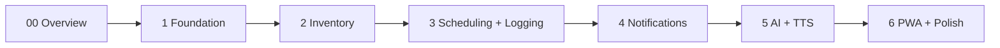

# ECZAM — Implementation Plans: Overview

This folder contains **phase-by-phase implementation plans** with full, copy-paste-ready
code for building ECZAM. Read this file first, then execute the phases in order.

| Phase | File | Outcome |
|---|---|---|
| 0 | this file | Scaffolding conventions, env, run instructions |
| 1 | [phase-1-foundation.md](phase-1-foundation.md) | Monorepo, full DB schema, auth + JWT, React shell |
| 2 | [phase-2-core-inventory.md](phase-2-core-inventory.md) | Catalog + inventory CRUD, barcode, leaflet viewer |
| 3 | [phase-3-scheduling-logging.md](phase-3-scheduling-logging.md) | Schedules, atomic dose logging, history |
| 4 | [phase-4-notifications.md](phase-4-notifications.md) | Web Push, scheduler jobs, expiration |
| 5 | [phase-5-ai-assistant-tts.md](phase-5-ai-assistant-tts.md) | pgvector ingestion, RAG SSE, chat, TTS |
| 6 | [phase-6-pwa-polish.md](phase-6-pwa-polish.md) | PWA, dashboard, accessibility, hardening |

> **Source of truth:** the [project brief](../ECZAM_PROJECT_BRIEF.md), [CLAUDE.md](../CLAUDE.md),
> and the [docs/](../docs/) suite. Each phase realizes the FR/US/UC IDs and exit criteria
> from [docs/mvp-definition.md](../docs/mvp-definition.md).

---

## 1. Monorepo layout

```
ECZAM/
├── backend/                       # Spring Boot (Java 21, Maven), package com.eczam
│   ├── pom.xml
│   ├── mvnw / mvnw.cmd
│   ├── docker-compose.yml         # Postgres + pgvector for dev
│   └── src/
│       ├── main/java/com/eczam/
│       │   ├── EczamApplication.java
│       │   ├── shared/            # web envelope, security, config
│       │   ├── auth/  users/ medications/ inventory/
│       │   ├── reminders/ logs/ expiration/
│       │   ├── notifications/push/ scheduler/
│       │   ├── ai/ integrations/barcode/
│       │   └── ...
│       ├── main/resources/
│       │   ├── application.yml
│       │   └── db/migration/      # Flyway V1__, V2__, ...
│       └── test/java/com/eczam/
├── frontend/                      # React 18 + TS + Vite PWA
│   ├── package.json
│   ├── vite.config.ts  tailwind.config.js  tsconfig.json  index.html
│   └── src/
│       ├── main.tsx  App.tsx
│       ├── components/ pages/ features/ services/ hooks/ contexts/ routes/ utils/
│       └── ...
├── docs/                          # documentation suite
└── plans/                         # these implementation plans
```

Backend package layering per domain (see [docs/system-architecture.md](../docs/system-architecture.md) §2):
`controller → service → repository → entity → dto → mapper`.

## 2. Toolchain & versions

| Tool | Version |
|---|---|
| JDK | 21 (Temurin) |
| Spring Boot | 3.2+ |
| Maven | via `./mvnw` wrapper |
| Node | 20+ |
| PostgreSQL | 16 + `pgvector` |
| Docker | for the dev DB |

## 3. Prerequisites

```bash
java -version     # 21
node -v           # 20+
docker -v
```

Start the dev database (compose file created in Phase 1):

```bash
cd backend && docker compose up -d
```

## 4. Environment variables (brief §11)

Backend reads these (e.g. via a `.env` exported into the shell, or your IDE run config).
Never hardcode secrets.

```bash
# App
NODE_ENV=development
PORT=8080
FRONTEND_URL=http://localhost:5173

# Database
DATABASE_URL=jdbc:postgresql://localhost:5432/eczam
DATABASE_USER=eczam
DATABASE_PASSWORD=eczam

# Auth
JWT_SECRET=change-me-to-a-long-random-string-at-least-32-bytes
JWT_EXPIRES_IN=7d

# Web Push (Phase 4) — generate once
VAPID_PUBLIC_KEY=
VAPID_PRIVATE_KEY=
VAPID_EMAIL=mailto:admin@eczam.app

# AI (Phase 5)
ANTHROPIC_API_KEY=
OPENAI_API_KEY=            # embeddings (or swap a local model)

# Redis (optional, Phase 4 scheduler clustering)
REDIS_URL=redis://localhost:6379

# Email (optional, Phase 4)
SMTP_HOST=
SMTP_PORT=
SMTP_USER=
SMTP_PASS=
```

Frontend (`frontend/.env`):

```bash
VITE_API_URL=http://localhost:8080/api/v1
VITE_VAPID_PUBLIC_KEY=     # mirror of VAPID_PUBLIC_KEY (Phase 4)
```

## 5. Shared backend conventions (built in Phase 1, reused everywhere)

- **Response envelope** `{ data, meta, error }` via `ApiResponse<T>` + `@RestControllerAdvice`
  `GlobalExceptionHandler`. Validation failures → **422** with `error.fields`.
- **Auth:** `Authorization: Bearer <JWT>` enforced by `JwtAuthFilter` in a stateless
  Spring Security chain; passwords hashed with bcrypt.
- **Pagination:** cursor-based on list endpoints; `meta.nextCursor`.
- **API base path:** `/api/v1` (set via `server.servlet.context-path` or controller
  mappings). All endpoints documented in [docs/api-specification.md](../docs/api-specification.md).
- **Persistence:** UUID PKs, `TIMESTAMPTZ`, JSONB, arrays, `vector(1536)` — see
  [docs/database-design.md](../docs/database-design.md).

## 6. How to run

```bash
# Terminal 1 — database
cd backend && docker compose up -d

# Terminal 2 — backend API (http://localhost:8080)
cd backend && ./mvnw spring-boot:run

# Terminal 3 — frontend (http://localhost:5173)
cd frontend && npm install && npm run dev
```

Tests:

```bash
cd backend && ./mvnw test          # JUnit + Testcontainers
cd frontend && npm test            # Vitest
```

## 7. Phase dependency chain



Each phase is a working vertical slice. After Phase 1+walking-skeleton (register → add med
→ schedule → log dose → see decrement) you have a runnable app; later phases add
capability without breaking earlier slices.

## 8. Conventions for these plan files

- Every code block is a **complete file**, preceded by its **target path** as a sub-heading.
- Backend code is **Java 21 / Spring Boot**; frontend is **React + TypeScript**.
- Each phase ends with **Exit criteria** and **Tests** drawn from
  [docs/mvp-definition.md](../docs/mvp-definition.md) and [docs/test-plan.md](../docs/test-plan.md).
